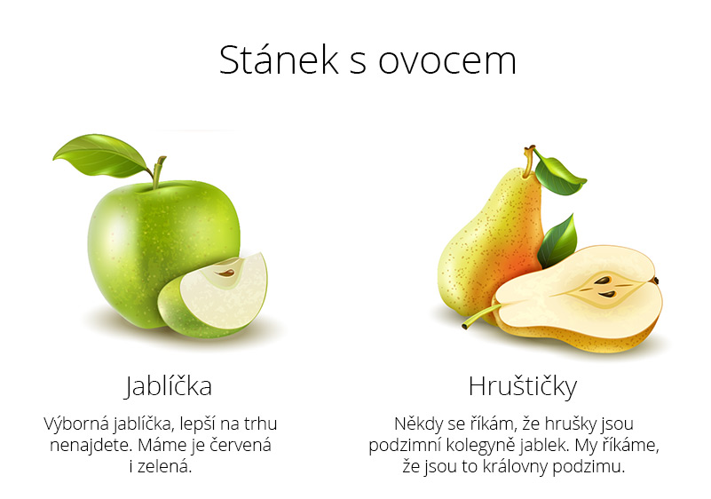

# Cvičení 2 - Stánek s ovocem

Vytvoř v Reactu stránku, která bude vypadat jako na obrázku:




1. Ve své složce, kde si vytváříš projekty pro tento kurz, si pomocí `create-czechitas-app` vyrob nový projekt. Nazvi ho třeba `ovoce`.

1. Pomocí `npm run start` v terminálu zkus projekt spustit, abyses přesvědčila, že všecno správně funguje.

1. Zatím neumíme složitější věci, takže opět vymažeme většinu souboru `index.jsx`. Necháme si vršek, kde se importuje React a CSS. Z prostředka smažeme funkci App. Necháme si funkci render, jen v ní později upravíme první parametr.

1. Vytvoříme si proměnnou `content` a vložíme do ní následující JSX obsah:

	```jsx
	<h1>Stánek s ovocem</h1>
	<div className="fruitstand"></div>
	```

	Všimněte si, že se jedná o dvě zančky, takže abychom obsah proměnné mohli poslat do funkce `render`, musíme je zabalit buď do jiné značky nebo do fragmentu.

	Proměnnou `content` použij ve funkci `render` místo značky `<App />` (vysvětlíme si později) a podívej se, zda se tvoje stránka přehkreslila o zobrazuje nadpis.

1. Vytvoř si dva objekty, které obsahují informace o ovoci, dle následujícího vzoru:

	```jsx
	const apples = {
		name: 'Jablíčka',
		image: 'sem později doplníš adresu obrázku',
		text: 'Výborná jablíčka, lepší na trhu nenajdete. Máme je červená i zelená.'
	};

	const pears = {
		name: 'Hruštičky',
		image: 'sem později doplníš adresu obrázku',
		text: 'Někdy se říkám, že hrušky jsou podzimní kolegyně jablek. My říkáme, že jsou to královny podzimu.'
	};
	```

1. Jako adresy obrázků si zkopíruj adresy z následujících odkazů: [jablko](https://github.com/Czechitas-React-podklady/React-lekce-03/raw/main/cviceni-02/jablko.jpg) a [hruška](https://github.com/Czechitas-React-podklady/React-lekce-03/raw/main/cviceni-02/hruska.jpg).

1. HTML pro kartičku ovoce na stránce vypadá takto:

	```html
	<div class="fruit">
		
		<h2 class="fruit__name">Název ovoce</h2>
		<p class="fruit__text">Popis ovoce</p>
	</div>
	```

	Převeď tento kód na JSX a vlož ho na stránce do elementu `.fruitstand` uvnitř proměnné `content` - jednou pro každé ovoce.  Nezapomeň, že v JSX se místo `class` píše `className`.

1. Do JSX doplň data z objektů `apples` a `pears`.

1. Pokud máš čas a chuť, připoj do stránky CSS styl a nastyluj stránku alespoň přibližně podle obrázku.